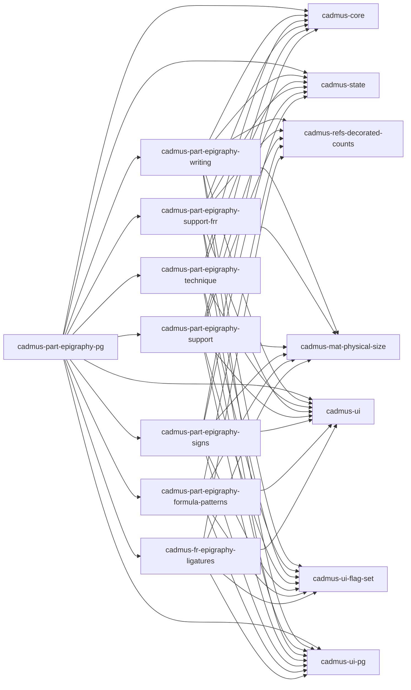

# Cadmus Epigraphy Shell

This project was generated using [Angular CLI](https://github.com/angular/angular-cli) version 19.0.6.

Cadmus epigraphic components development shell.

- [models](https://github.com/vedph/cadmus-epigraphy)
- [API](https://github.com/vedph/cadmus-epigraphy-api)

## Docker

🐋 Quick Docker image build:

1. `npm run build-lib` (publish if required);
2. update version in `env.js` (and Docker files) and `ng build`;
3. `docker build . -t vedph2020/cadmus-epigraphy-shell:1.0.0 -t vedph2020/cadmus-epigraphy-shell:latest` (replace with the current version).

## Libraries



## Setup

Script which created this workspace:

```sh
ng new cadmus-epigraphy-shell
ng add @angular/material
ng add @angular/localize

ng g library @myrmidon/cadmus-fr-epigraphy-ligatures --prefix cadmus --force
ng g library @myrmidon/cadmus-part-epigraphy-formula-patterns --prefix cadmus --force
ng g library @myrmidon/cadmus-part-epigraphy-pg --prefix cadmus --force
ng g library @myrmidon/cadmus-part-epigraphy-signs --prefix cadmus --force
ng g library @myrmidon/cadmus-part-epigraphy-support --prefix cadmus --force
ng g library @myrmidon/cadmus-part-epigraphy-support-frr --prefix cadmus --force
ng g library @myrmidon/cadmus-part-epigraphy-technique --prefix cadmus --force
ng g library @myrmidon/cadmus-part-epigraphy-writing --prefix cadmus --force
```

## History

### 10.0.0

- 2025-03-27:
  - updated Angular and packages.
  - changed part editor titles to take advantage of `modelName`.
  - added `grooveType` to `EpiTechniquePart`.
  - ⚠️ [refactored model](https://github.com/vedph/cadmus-epigraphy/blob/master/docs/epi-support.md) of `EpiSupportPart`.

### 9.0.0

- 2025-01-28: ⚠️ updated Cadmus dependencies for signals. The only relevant change (apart from version numbers) is changing part feature data change event handler: `(dataChange)="save($event!.value!)"`.

### 8.0.1

- 2025-01-24: ⚠️ migrated to signals. This did not affect `@myrmidon/cadmus-fr-epigraphy-ligatures` which had no `@Input` or `@Output` endpoints.
- 2025-01-23: updated packages.

### 8.0.0

- 2025-01-04: ⚠️ updated [Cadmus dependencies](https://github.com/vedph/cadmus-shell-v3) to version 11 (standalone components).

### 7.0.0

- 2025-01-01:
  - ⚠️ standalone components.
  - removed legacy `color` directives.
  - updated packages.
  - refactored shell app for modern Angular.
- 2024-12-31: updated packages and peer dependencies.

### 6.1.0

- 2024-12-23:
  - ⚠️ upgraded to [bricks V3](https://github.com/vedph/cadmus-bricks-shell-v3).
  - removed legacy code.

### 6.0.1

- 2024-12-18:
  - fix to technique part.
  - M3 styles.

### 6.0.0

- 2024-12-03: ⚠️ upgraded to new core dependencies.

### 5.0.0

- 2024-11-22: ⚠️ upgraded to Angular 19.
- 2024-11-20: added `inSitu` to support part.
- 2024-11-18: updated Angular and packages.
- 2024-11-10: updated Angular and packages.

### 4.0.0

- 2024-10-30:
  - ⚠️ renamed support and writing part into old to allow for new models for them. Affected libraries bump to 4.0.0.
  - added new support, writing, and technique parts.
  - updated peer dependencies.
- 2024-09-16: updated Angular and packages.
- 2024-07-15: refactored fr part and editor (`@myrmidon/cadmus-part-epigraphy-support-frr@0.0.3`).
- 2024-06-23: added new parts.
- 2024-06-22: updated Angular and packages.

### 3.1.1

- 2024-06-09:
  - updated Angular and packages.
  - added `class="mat-X"` for each `color="X"` (e.g. `class="mat-primary"` wherever there is a `color="primary"`) to allow transitioning to Angular Material M3 from M2. This also implies adding it directly to the target element, so in the case of `mat-icon` inside a `button` with `color` the class is added to `mat-icon` directly (unless the button too has the same color). This allows to keep the old M2 clients while using the new M3, because it seems that the compatibility mixin is not effective in some cases like inheritance of `color`, and in the future `color` will be replaced by `class` altogether.
  - updated to modern control flow syntax.
  - applied [M3 theme](https://material.angular.io/guide/theming).

### 3.1.0

- 2024-05-24: ⚠️ upgraded to Angular 18. All the epigraphy libraries versions have been bumped to **version** 3.1.0.
- 2024-04-13: ⚠️ upgraded to [bricks V2](https://github.com/vedph/cadmus-bricks-shell-v2). All the epigraphy libraries versions have been bumped to **version** 3.0.0.
- 2024-03-21: updated Angular and packages, replacing `ngx-monaco-editor` with [ngx-monaco-editor-v2](https://github.com/miki995/ngx-monaco-editor-v2). This changes affects only the shell UI, not the libraries.

### 2.0.0

- 2023-11-09: ⚠️ upgraded to Angular 17.
- 2023-11-07:
  - updated Angular and packages.
  - removed ELF.
  - opted in for thesauri import.

### 1.0.0

- 2023-06-17:
  - updated Angular and packages.
  - moved to PostgreSQL.
- 2023-05-24: updated Angular and packages. No changes required for introducing `AssertedCompositeId` here, so libraries versions stay the same.
- 2023-05-12: updated to Angular 16.
- 2023-04-13: token values in formula editor.

### 0.0.2

- 2023-03-11: updated Angular and packages.
- 2023-03-08:
  - adding epigraphic formula patterns part.
  - updated Angular and packages.
- 2023-02-11: integrated new flags component.
- 2023-02-10: updated Angular and packages.

### 0.0.1

- 2023-01-28: updated packages.
- 2023-01-05: added MapBoxGL for asserted locations.
