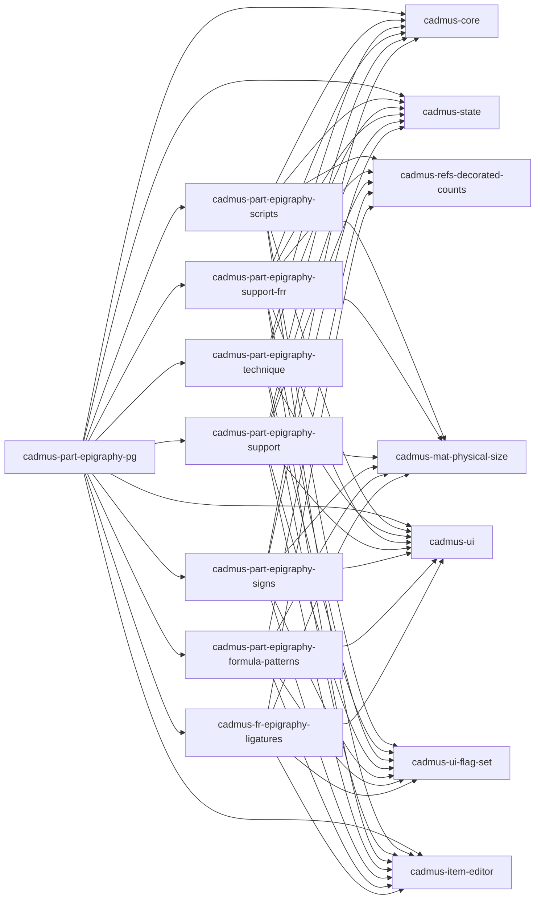

# Cadmus Epigraphy Shell

This project was generated using [Angular CLI](https://github.com/angular/angular-cli) version 19.0.6.

Cadmus epigraphic components development shell.

- [models](https://github.com/vedph/cadmus-epigraphy)
- [API](https://github.com/vedph/cadmus-epigraphy-api)

## Docker

🐋 Quick Docker image build:

1. `npm run build-lib` (publish if required);
2. update version in `env.js` (and Docker files) and `ng build`;
3. `docker build . -t vedph2020/cadmus-epigraphy-shell:1.0.0 -t vedph2020/cadmus-epigraphy-shell:latest` (replace with the current version).

## Libraries


```mermaid
graph LR;
  cadmus-fr-epigraphy-ligatures --> cadmus-mat-physical-size
  cadmus-fr-epigraphy-ligatures --> cadmus-refs-decorated-counts
  cadmus-fr-epigraphy-ligatures --> cadmus-ui-flag-set
  cadmus-fr-epigraphy-ligatures --> cadmus-ui
  cadmus-fr-epigraphy-ligatures --> cadmus-item-editor
  cadmus-part-epigraphy-formula-patterns --> cadmus-mat-physical-size
  cadmus-part-epigraphy-formula-patterns --> cadmus-refs-decorated-counts
  cadmus-part-epigraphy-formula-patterns --> cadmus-ui-flag-set
  cadmus-part-epigraphy-formula-patterns --> cadmus-ui
  cadmus-part-epigraphy-formula-patterns --> cadmus-item-editor
  cadmus-part-epigraphy-signs --> cadmus-mat-physical-size
  cadmus-part-epigraphy-signs --> cadmus-ui-flag-set
  cadmus-part-epigraphy-signs --> cadmus-core
  cadmus-part-epigraphy-signs --> cadmus-state
  cadmus-part-epigraphy-signs --> cadmus-ui
  cadmus-part-epigraphy-signs --> cadmus-item-editor
  cadmus-part-epigraphy-support --> cadmus-refs-decorated-counts
  cadmus-part-epigraphy-support --> cadmus-ui-flag-set
  cadmus-part-epigraphy-support --> cadmus-mat-physical-size
  cadmus-part-epigraphy-support --> cadmus-core
  cadmus-part-epigraphy-support --> cadmus-state
  cadmus-part-epigraphy-support --> cadmus-ui
  cadmus-part-epigraphy-support --> cadmus-item-editor
  cadmus-part-epigraphy-support-frr --> cadmus-refs-decorated-counts
  cadmus-part-epigraphy-support-frr --> cadmus-ui-flag-set
  cadmus-part-epigraphy-support-frr --> cadmus-mat-physical-size
  cadmus-part-epigraphy-support-frr --> cadmus-core
  cadmus-part-epigraphy-support-frr --> cadmus-state
  cadmus-part-epigraphy-support-frr --> cadmus-ui
  cadmus-part-epigraphy-support-frr --> cadmus-item-editor
  cadmus-part-epigraphy-technique --> cadmus-ui-flag-set
  cadmus-part-epigraphy-technique --> cadmus-core
  cadmus-part-epigraphy-technique --> cadmus-state
  cadmus-part-epigraphy-technique --> cadmus-ui
  cadmus-part-epigraphy-technique --> cadmus-item-editor
  cadmus-part-epigraphy-scripts --> cadmus-mat-physical-size
  cadmus-part-epigraphy-scripts --> cadmus-refs-decorated-counts
  cadmus-part-epigraphy-scripts --> cadmus-ui-flag-set
  cadmus-part-epigraphy-scripts --> cadmus-core
  cadmus-part-epigraphy-scripts --> cadmus-state
  cadmus-part-epigraphy-scripts --> cadmus-ui
  cadmus-part-epigraphy-scripts --> cadmus-item-editor
  cadmus-part-epigraphy-pg --> cadmus-core
  cadmus-part-epigraphy-pg --> cadmus-state
  cadmus-part-epigraphy-pg --> cadmus-ui
  cadmus-part-epigraphy-pg --> cadmus-item-editor
  cadmus-part-epigraphy-pg --> cadmus-part-epigraphy-support
  cadmus-part-epigraphy-pg --> cadmus-part-epigraphy-support-frr
  cadmus-part-epigraphy-pg --> cadmus-part-epigraphy-scripts
  cadmus-part-epigraphy-pg --> cadmus-part-epigraphy-technique
  cadmus-part-epigraphy-pg --> cadmus-part-epigraphy-signs
  cadmus-part-epigraphy-pg --> cadmus-fr-epigraphy-ligatures
  cadmus-part-epigraphy-pg --> cadmus-part-epigraphy-formula-patterns
```

## Current Versions

- cadmus-fr-epigraphy-ligatures: 13.0.0
- cadmus-part-epigraphy-formula-patterns: 14.0.0
- cadmus-part-epigraphy-scripts: 14.0.0
- cadmus-part-epigraphy-signs: 13.0.0
- cadmus-part-epigraphy-support: 14.0.0
- cadmus-part-epigraphy-support-frr: 13.0.0
- cadmus-part-epigraphy-technique: 13.0.0
- cadmus-part-epigraphy-pg: 15.0.0

## Workspace Setup

Script which created this workspace:

```sh
ng new cadmus-epigraphy-shell
ng add @angular/material
ng add @angular/localize

ng g library @myrmidon/cadmus-fr-epigraphy-ligatures --prefix cadmus --force
ng g library @myrmidon/cadmus-part-epigraphy-formula-patterns --prefix cadmus --force
ng g library @myrmidon/cadmus-part-epigraphy-scripts --prefix cadmus --force
ng g library @myrmidon/cadmus-part-epigraphy-signs --prefix cadmus --force
ng g library @myrmidon/cadmus-part-epigraphy-support --prefix cadmus --force
ng g library @myrmidon/cadmus-part-epigraphy-support-frr --prefix cadmus --force
ng g library @myrmidon/cadmus-part-epigraphy-technique --prefix cadmus --force
ng g library @myrmidon/cadmus-part-epigraphy-pg --prefix cadmus --force
```
